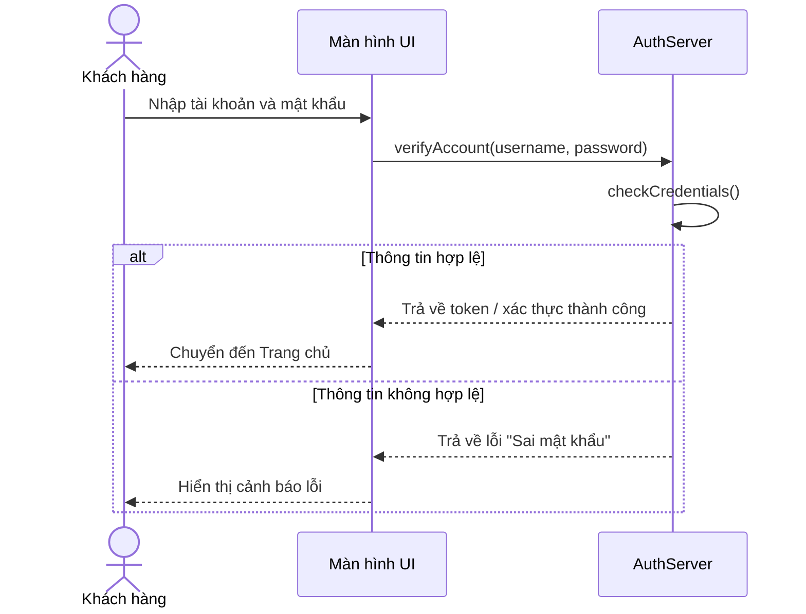

# RikkeiShop - Thiết kế Sequence Diagram tính năng Đăng nhập

## Giới thiệu
Dự án này mô tả luồng hoạt động của chức năng đăng nhập trong hệ thống RikkeiShop bằng sơ đồ tuần tự (Sequence Diagram). Mục tiêu là làm rõ cách các đối tượng tương tác với nhau trong quá trình xác thực tài khoản.

## Mục tiêu
- Trình bày rõ quy trình đăng nhập từ phía người dùng đến hệ thống xác thực.
- Phân tách rõ vai trò của các thành phần chính.
- Mô tả trường hợp thành công và trường hợp thất bại.

## Cấu trúc hệ thống
Hệ thống gồm 3 thành phần chính:

1. Khách hàng
   - Người dùng nhập thông tin đăng nhập.
2. Màn hình UI
   - Tiếp nhận dữ liệu từ người dùng và gửi yêu cầu xác thực.
3. AuthServer
   - Xử lý xác thực tài khoản và trả về kết quả.

---

## Luồng nghiệp vụ
### 1. Người dùng nhập thông tin
Khách hàng thực hiện đăng nhập bằng cách cung cấp tài khoản và mật khẩu trên giao diện.

### 2. Gửi yêu cầu xác thực
Màn hình UI nhận dữ liệu và gửi yêu cầu `verifyAccount()` tới `AuthServer`.

### 3. Kiểm tra thông tin
`AuthServer` thực hiện kiểm tra thông tin đăng nhập bằng phương thức `checkCredentials()`.

### 4. Xử lý kết quả
- Nếu thông tin hợp lệ:
  - `AuthServer` trả về token hoặc xác nhận thành công.
  - UI chuyển hướng người dùng tới trang chủ.
- Nếu thông tin không hợp lệ:
  - `AuthServer` trả về lỗi như `Sai mật khẩu`.
  - UI hiển thị cảnh báo và yêu cầu người dùng nhập lại.

---

## Sơ đồ Sequence Diagram

---

## Ý nghĩa của sơ đồ
Sơ đồ trên giúp minh họa rõ ràng các bước tương tác giữa người dùng, giao diện và backend trong quá trình đăng nhập, đồng thời thể hiện rõ ràng nhánh điều kiện thành công và thất bại.

## Kết luận
Quá trình đăng nhập được thực hiện tuần tự và có kiểm tra điều kiện rõ ràng, đảm bảo hệ thống xác thực đúng người dùng và xử lý lỗi hiệu quả.

---

## Tác giả
- CNTT5 - Phạm Đình Thương
- Session 10 - Login RikkeiShop
